## 개인 - 게시글 토이 프로젝트

<hr/>

### ⚡프로젝트 소개

#### 시작하게 된 이유
> - SSR(Server Side Rendering) 프로젝트
> - MyBatis를 이용하여 게시글을 만들기
> - 페이징 처리 학습
> - 게시글 좋아요 기능 구현
> - Spring Batch 이용

<hr/>

### ⚙️ 기술 정보
<div>


<hr/>

### 🚧 버전 관리 및 진행
> 2023.10~2023.12 Version 1
- [x] Spring Security를 이용하여 회원가입 및 로그인 구현 (권한 : ROLE_USER, ROLE_ADMIN)
- [x] Member, Board CRUD 단위 테스트
- [x] Board(게시판) 페이징 처리 추가
- [x] 권한에 따른 하이퍼링크 설정 (thymeleaf-extras-spring security 5 사용)
- [x] 회원가입, 로그인 Bean Validation 설정 및 Thymeleaf, 처리 실패  나오게 하기 (Binding Result)
- [x] FILE 테이블 작성 및 조회 질의 및 insert 질의 작성
- [x] Board File domain 모델 작성 및 board Mapper result Map 작성 및 1:N join으로 한방 질의 작성 (SELECT)
- [x] 게시글 작성 시 파일 업로드 가능하게 (FILE 테이블) 작성 (FileStore, UploadFile)
- [x] 이미지 파일, 첨부 파일 구분하게 하여 (FILE_IMAGE_NY 칼럼) 첨부 파일은 내려받을 수 있게 하고, 이미지 파일은 IMG 태그에서 가져올 수 있게 분리
- [x] 이미지 파일 업로드 시 확장자 검사 (.jpg, .png, .gif)
- [x] 파일 용량 크면 에러 페이지 및 글로벌 오류  X -> MaxFileSize 및 MaxRequestSize 설정 및 Javascript로 파일 용량 이상 시 alert 처리
- [x] 이미지 파일 이름으로 다운 받을 때 DB에 존재하지 않을 경우 404 오류 페이지 응답
- [x] 이미지 파일은 최대 3개까지 업로드
- [x] 게시글 Repository(Mapper) 삭제 및 수정질의 작성 및 테스트
- [x] 사용자 Exception 정의 및 Controller Advice 및 Exception Handler으로 예외 페이지 반환
- [x] 게시글을 삭제 할 때 board_delete_date에 삭제 시간 값 Update
- [x] 게시글을 조회 시 페이징 처리에서 필요한 getPageMaxCount 에서 where 문 작성 (게시글 삭제 날짜가 null 일 경우에만 카운트)
- [x] 게시글을 삭제 및 수정할 때 존재하지 않는 게시글인지, 이미 삭제된 게시글인지, 게시글 글쓴이인지 확인 및 Exception 처리
- [x] 게시글 삭제, 수정 폼 작성 및 컨트롤러 작성
- [x] 게시글을 수정 할 때 첨부 파일 및 이미지 변경 시 존재 했던 파일이 존재 하지 않을 경우 DELETE, 파일이 추가된 경우 INSERT (저장소에서도 파일 삭제 및 추가)
- [x] RuntimeException 상속 받는 사용자 정의 예외 만들기
- [x] 댓글 작성 및 댓글 삭제 기능 추가
- [x] 게시글 및 댓글을 각각 다른 페이징 처리(레코드 크기 및 페이지 크기 각각 다르게)로 분리해야 하기 때문에, 추상 클래스 Search를 만들어서 BoardSearchDto(게시글DTO), ReplySearchDto(댓글DTO)로 분리
- [x] Pagination 생성자 방법에서는 Search(상속받은 추상 클래스)로 업 캐스팅 후 로직 진행 (다형성)
- [x] 키워드로 검색하기, 최근 순 정렬,
- [x] 닉네임 Unique Key로 변경 (회원가입 시 중복 제거)
- [x] 스프링 배치를 이용하여 삭제된 지 7일이 지나면 DB에서도 삭제
- [x] 배치(Batch): Board 삭제, 제약조건 ON DELETE CASCADE로 인하여 FILE 테이블에 존재하는 연관된 칼럼 삭제
- [x] 게시글 삭제 시 FILE 테이블의 데이터도 삭제되기 때문에 스토리지에 있는 파일도 같이 삭제한다.
- [x] 게시글 복구 페이지 작성 및 게시글 복구 로직 추가

> 2024.03~2024.03 Version 2
- [x] 게시글 좋아요(Likes) 테이블 및 추가, 삭제 기능 추가
- [x] 게시글 조회 시 좋아요 정렬 기능 추가

<hr/>

### ⚒️ 프로젝트 진행 중 문제 발생 및 해결 
#### 문제 
BoardService에서 File과 Board 관련 로직이 있는데 로직 진행 도중 Exception으로 인하여 rollback 되어도 파일이 삭제가 되는 현상이 발생하였습니다.
#### 해결 방안
BoardService에 File과 Board 관련 로직이 한번에 작성되어 한 트랜잭션 안에서 이루어지기 때문에 생긴 문제여서, BoardService에서 삭제할 파일을 ArrayList로 담아 반환하여 컨트롤러에서 반환 받은 리스트를 가지고 FileService로 보내 파일 삭제를 진행하였습니다.
#### 회고록
처음 설계에서 File 관련된 로직이 많지 않을 것 같아 BoardService에 함께 작성을 했는데 코드의 복잡성과 책임이 많아지게 되었습니다. 앞으로 설계 할 때는 단일 책임 원칙을 잘 따라야겠다는 배움을 얻었습니다. (SOLID, SRP 단일 책임 원칙)

<hr/>

### 💡 프로젝트 실행 이미지
#### 최초 화면(메인)
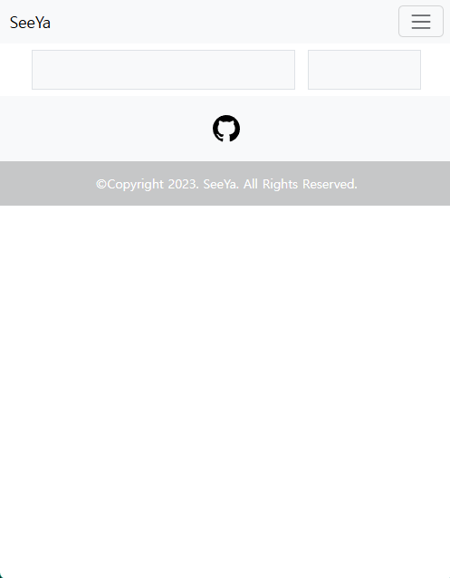
#### 목록 (메인, 로그인, 회원가입)
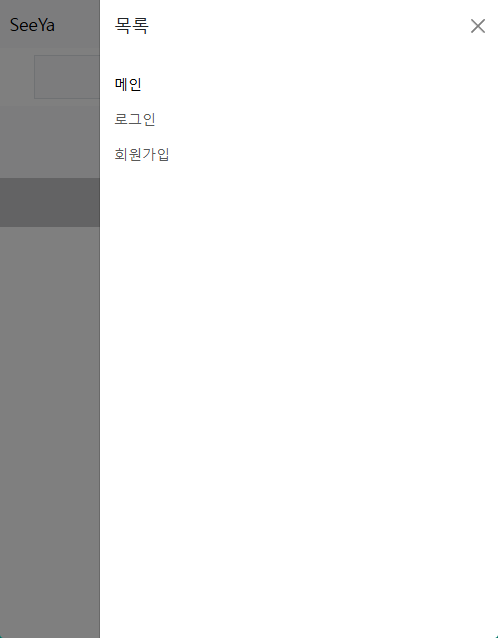
#### 회원 가입
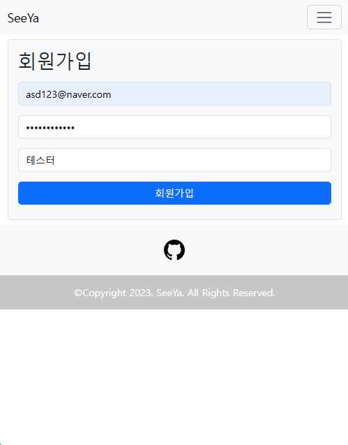
#### 로그인
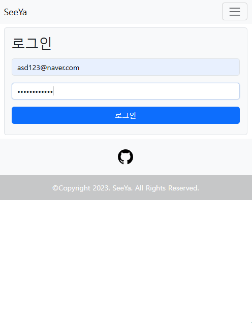
#### 로그인 된 최초 화면(메인)
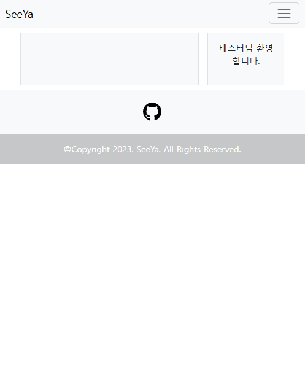
#### 로그인 된 목록
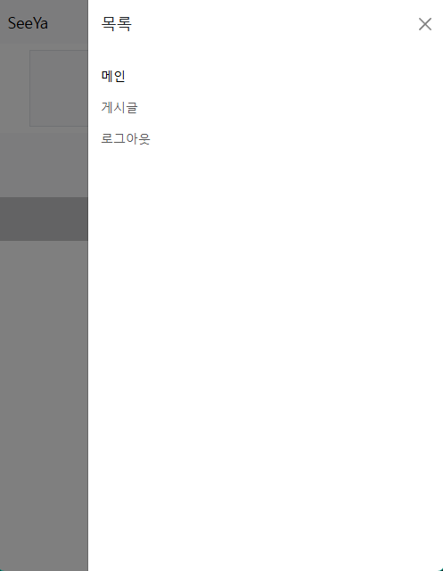
#### 게시글 목록
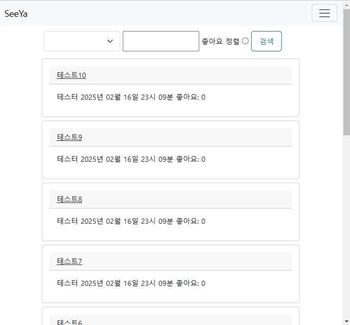
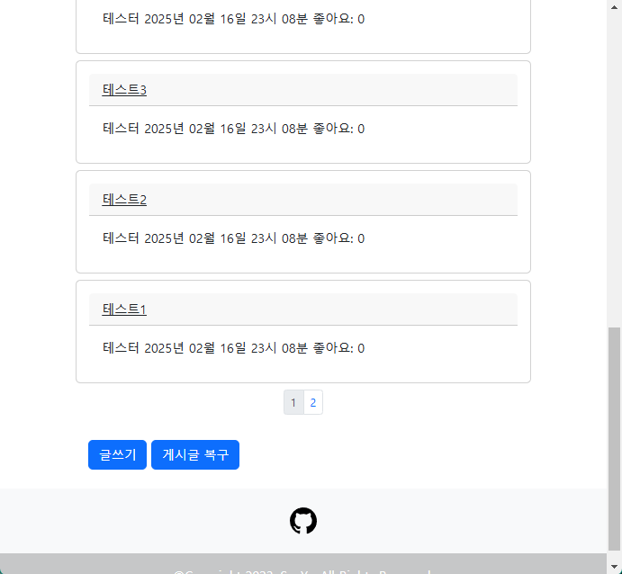
#### 게시글 작성
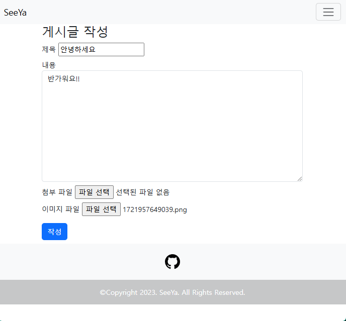
#### 작성된 게시글
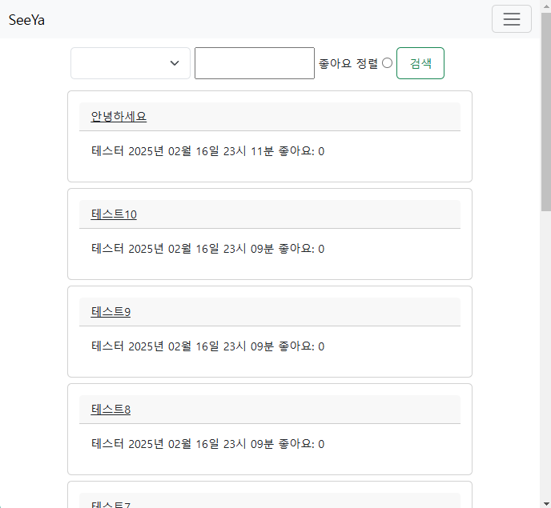
#### 게시글 상세
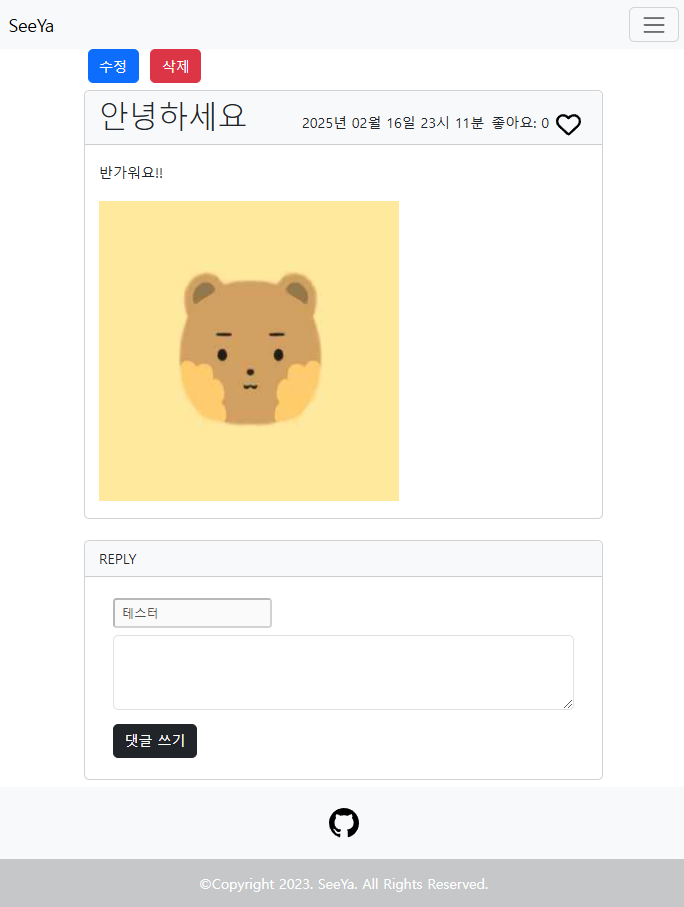
#### 댓글이 작성 된 게시글
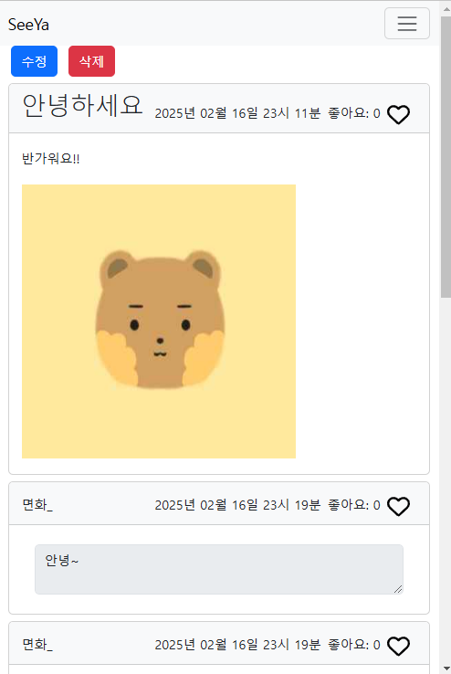
#### 페이징 처리가 된 댓글
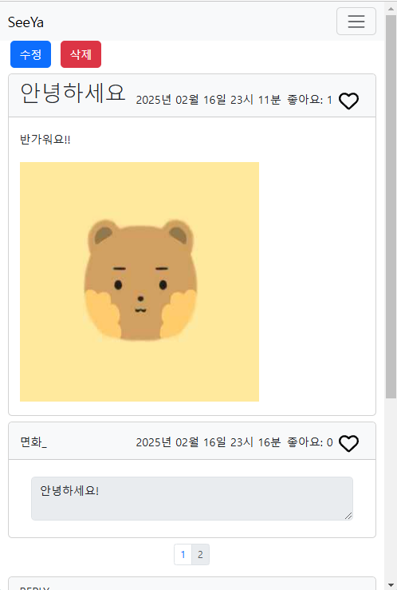
#### 게시글 수정 
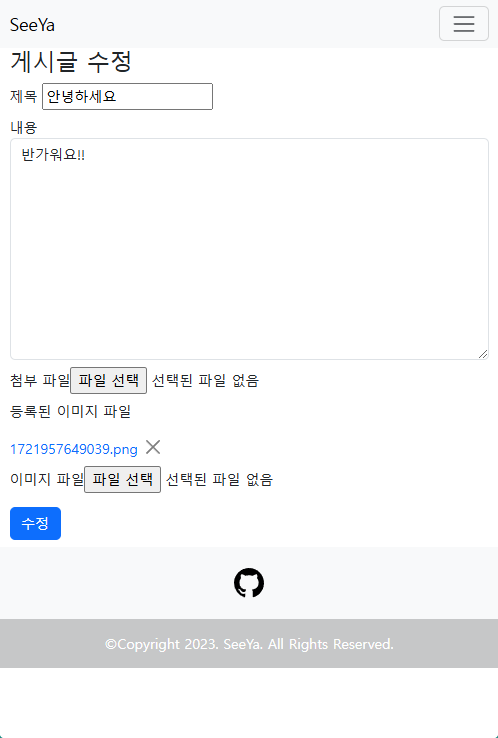
#### 수정 된 게시글 
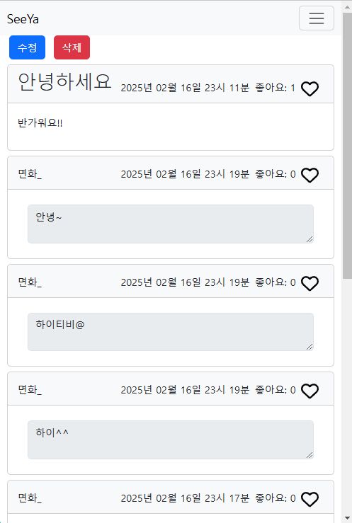
#### 삭제 된 게시글 
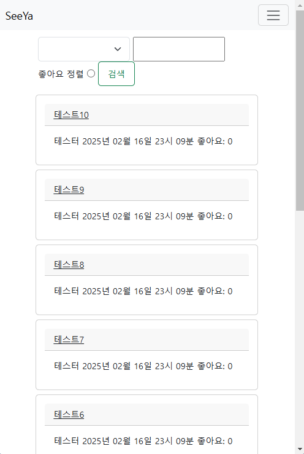
#### 게시글 복구
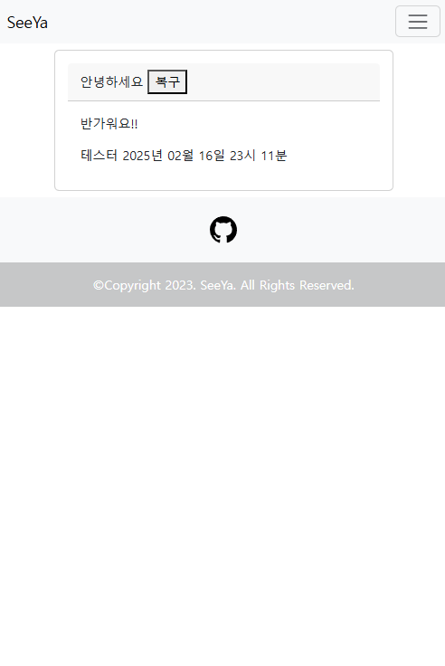

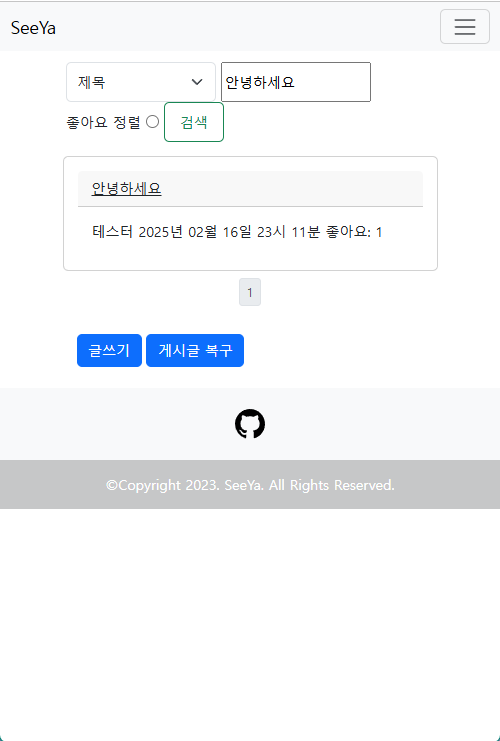
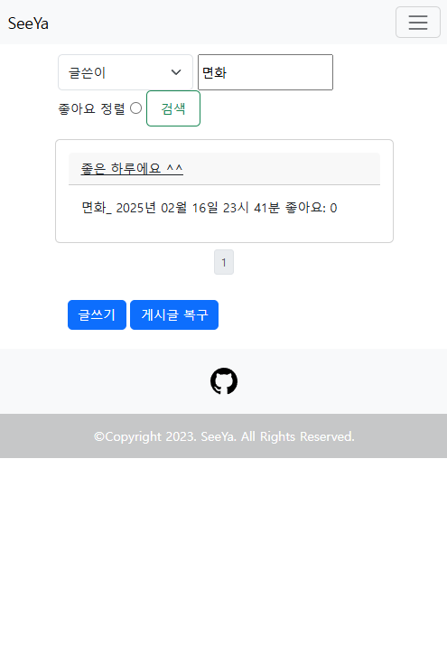
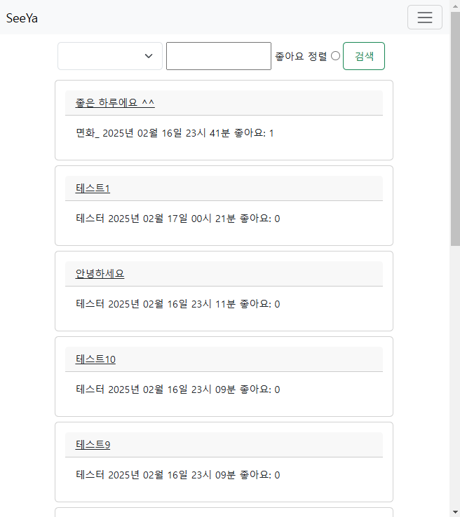

<hr/>

### 🔍 프로젝트 상세
#### ERD-Cloud
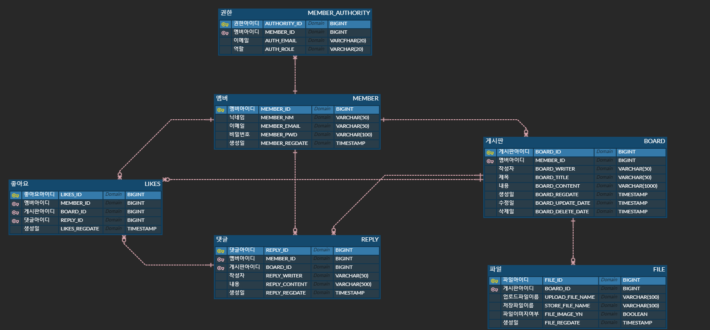

<hr/>

### 🌳 개발 환경

- Project: Gradle
- SpringBoot: 2.7.15
- Language: Java 11
- Dependencies
  - mybatis-spring-boot-starter:2.3.1
  - spring-boot-starter-batch
  - spring-boot-starter-quartz
  - spring-boot-starter-security
  - spring-boot-starter-web
  - spring-boot-starter-validation
  - spring-boot-starter-thymeleaf
  - spring-boot-starter-test
  - mysql-connector-j
  - lombok

<br/>
<hr/>

### 🎶 배포 과정
#### 사용 툴
- VMWare Workstation 17 player, Putty, FileZilla
- HostOS: Windows 11
- guestOS: CentOS Stream 9

#### 버전
- nginx: 1.20.1
- MySQL: 8.4.1
- JDK: 17.0.6

#### 순서
1. 가상 OS VM Ware 프로그램 설치
2. 운영체제 CentOS Stream 9 설치
3. Putty로 접속할 관리자 계정 생성
4. 접속은 외부 서버가 있다고 가정하여 Putty로 SSH 접속 및 파일은 FileZilla를 통해 파일 옮기기
5. Java Development Kit(JDK) 설치
6. nginx 설치, 접속 테스트
7. Host OS 공유기에 포트 포워딩 설정(80, 443), VMWare 포트 포워딩 설정(80, 443 외부 접속 허용)
8. Firewall(방화벽) 80, 443 포트 열기
9. '내도메인.한국' 무료 DNS 사용 및 Host 외부 IP 연결
10. MySQL 설치 및 계정 생성, 데이터베이스 생성 및 테이블 추가
11. Spring Boot 이용하여 빌드(BootJar) 후 파일 systemctl(서비스) 등록
12. Certbot 이용하여 무료 lets' encrypt SSL/TLS 설치 및 nginx.conf 파일 설정
13. 서비스 실행 및 외부 사용자 접속 테스트

#### nginx.conf
```nginx
user nginx;
worker_processes auto;
error_log /var/log/nginx/error.log;
pid /run/nginx.pid;

events {
    worker_connections 1024;
}

http {
    client_max_body_size 10M;

    upstream app {
       server 127.0.0.1:8080;
    }

    underscores_in_headers on;
    include /etc/nginx/mime.types;
    default_type application/octet-stream;

    # Redirect all Traffic to HTTPS
    server {
      listen 80;

	  location ~ /\.well-known/acme-challenge/ {
	  	allow all;
		root /var/www/letsencrypt;
	  }

      return 301 https://$host$request_uri;
    }
 
    server {
      listen 443 ssl http2;
      ssl_certificate /etc/letsencrypt/live/nineto6.p-e.kr/fullchain.pem;
      ssl_certificate_key /etc/letsencrypt/live/nineto6.p-e.kr/privkey.pem;

      # Disable SSL
      ssl_protocols TLSv1 TLSv1.1 TLSv1.2;
     
      # 통신과정에서 사용할 암호화 알고리즘
      ssl_prefer_server_ciphers on;
      ssl_ciphers ECDH+AESGCM:ECDH+AES256:ECDH+AES128:DH+3DES:!ADH:!AECDH:!MD5;

      # Enable HSTS
      # client의 browser에게 http로 어떠한 것도 load하지 말라고 규제합니다.
      add_header Strict-Transport-Security "max-age=31536000" always;

      # SSL sessions
      ssl_session_cache shared:SSL:10m;
      ssl_session_timeout 10m;
    
      location / {
        proxy_pass http://app;
        proxy_set_header Host $host;
        proxy_set_header X-Nginx-Proxy true;
        proxy_set_header X-Real-IP $remote_addr;
        proxy_set_header X-Forwarded-For $proxy_add_x_forwarded_for;
        proxy_set_header X-Forwarded-Proto $scheme;
      } 
    }
}
```

#### myboard.service
```
[Unit]
Description=MyBoard Description
After=syslog.target network.target myboard.service

[Service]
ExecStart=/bin/bash -c "exec java -jar /home/ikavon/server/myboard/myboard-0.0.1-SNAPSHOT.jar --spring.profiles.active=prod"
Restart=on-failure
RestartSec=10

User=root
group=root

[Install]
WantedBy=multi-user.taget
```
